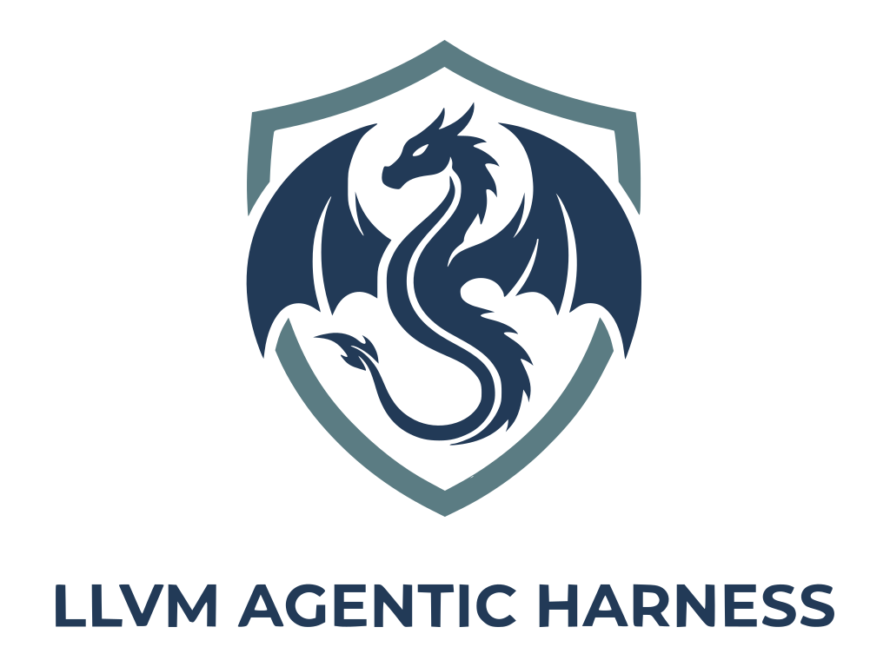

<p align="center" style="margin-top: 0; margin-bottom: 0;">
  
</p>

llvm-harness is an agentic harness of [LLVM](https://github.com/llvm/llvm-project). Its current focus is automatic repair of LLVM bugs and systematic evaluation of agents' ability to resolve LLVM issues. **Longer term, it aims to become an off‑the‑shelf agentic harness for all LLVM tasks that benefit from an agent**. It includes:

+ [llvm harness](./harness): A collection of agent-friendly LLVM [tools](./harness/tools) and LLVM domain knowledge built into [skills](./harness/skills).
+ [llvm-bench (live)](./bench): A continuously updated benchmark of recent LLVM issues, currently focused on middle-end bugs.
+ [llvm-autofix](./autofix): A minimal proof-of-concept agent targeted at fixing LLVM middle-end issues.
+ [llvm-autoreview](./autoreview): A minimal proof-of-concept agent targeted at reviewing LLVM PRs.

## 🔥 News

- 2026-05-27: Integrate [Archer](https://github.com/cuhk-s3/Archer), which was built based on an early version of this harness, into `llvm-autoreview`.
- 2026-05-16: Support fixing middle-end bugs reduced by [llvm-autoreduce](https://github.com/dtcxzyw/llvm-autoreduce) with `--autoreduce --issue ID`.
- 2026-04-16: The project was renamed to `llvm-harness`.
- 2026-04-03: We started refactoring of the project and plan to rename it to `llvm-harness`.
- 2026-03-20: We released `llvm-autofix`, an agentic harness for real-world compilers.

## 🗺️ Overview

Agents are being increasingly applied to real-world software engineering tasks, but their performance on complex, real-world codebases remains underexplored. Our evaluation of frontier models, including GPT‑5, Gemini 2.5 Pro, DeepSeek V3.2, and Qwen 3 Max, highlights several findings:

1. Although these models perform well on general SWE-bench Verified, they struggle on `llvm-bench live`: ~60% vs. ~38%.
3. As benchmark splits become more challenging (easy $\to$ medium $\to$ difficult), the performance of frontier models degrades significantly.
4. After code review by LLVM developers, the *true* bug-fixing capability of frontier models remains below 15%.

This project aims to bridge the gap between frontier models and LLVM by providing a comprehensive agentic harness, including tools, skills, and benchmarks. We have developed two minimal proof-of-concept agents, and with this harness:
1. `llvm-autofix (mini)` outperforms `mini-SWE-agent` by ~50% on `llvm-bench (live)` after code review, leading to a ~21% true bug-fixing capability.
2. `llvm-autoreview (archer)` has found more than 50 real LLVM bugs by reviewing LLVM's open and closed PRs. The most up-to-date Archer lives at: https://github.com/cuhk-s3/Archer.

However, we also found several challenges when using agents. This project is an ongoing effort to address these challenges and we welcome contributions from the community. For more details, please refer to our paper: [Agentic Harness for Real-World Compilers](https://arxiv.org/abs/2603.20075).

## 🔨 Build

The simplest way is using docker after editing `environments` and fill in the API keys:

```bash
docker build -t llvm-harness-base:latest -f .devcontainer/Dockerfile .
docker build -t llvm-harness:latest -f Dockerfile --build-arg USER_UID=$(id -u) --build-arg USER_GID=$(id -g) .
docker run --rm -it -v $(pwd):/llvm-harness --cap-add=SYS_PTRACE --security-opt seccomp=unconfined llvm-harness:latest
# tmux # Optional: spawn a tmux session if you want to see GDB's output.
source ./buildscripts/upenv.sh
```

Or follow [BUILD.md](./docs/BUILD.md) to install required dependencies and bring up the environment locally.

## 🚀 Launch

**Launch `llvm-autofix` on a specific issue with:**

```bash
python -m autofix.mini --autoreduce --issue <issue_id> --model <model_name>
```

where `<issue_id>` is the ID of the issue you want to fix, which can be found in the URL of [llvm-autoreduce issues](https://github.com/dtcxzyw/llvm-autoreduce/issues).

**Lauch `llvm-autoreview` on a specific PR with:**

```bash
python -m autoreview.archer --pr <pr_id> --model <model_name>
```

where `<pr_id>` is the ID of the PR you want to review, which can be found in the URL of the [llvm-project PRs](https://github.com/llvm/llvm-project/pulls).

## 📊 Benchmark

Benchmark `llvm-autofix` on our benchmarks with:

```bash
./bench/benchmark.sh <agent_name> -B <bench_name> -o <output_dir>
```

## 👨‍💻‍ Contributions

Please read guidelines in [CONTRIBUTORS.md](./CONTRIBUTORS.md).

## ✏️ Cite Us

If you found this work helpful, please consider citing our work:

```bibtex
@misc{llvm-harness,
  title={Agentic Harness for Real-World Compilers},
  author={Yingwei Zheng and Cong Li and Shaohua Li and Yuqun Zhang and Zhendong Su},
  year={2026},
  eprint={2603.20075},
  archivePrefix={arXiv},
  primaryClass={cs.SE},
  url={https://arxiv.org/abs/2603.20075},
}
```

Artifacts for the arXiv paper are available at the [experiment](https://github.com/dtcxzyw/llvm-autofix/tree/experiment) branch.

## 🤝 Acknowledgements

1. The logo was co-designed with Nano Banana.
2. This project is partially supported by an award from the Hasler Foundation.
